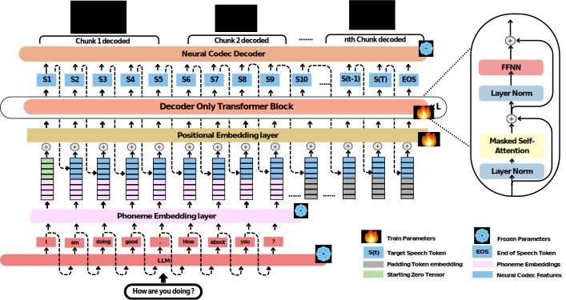
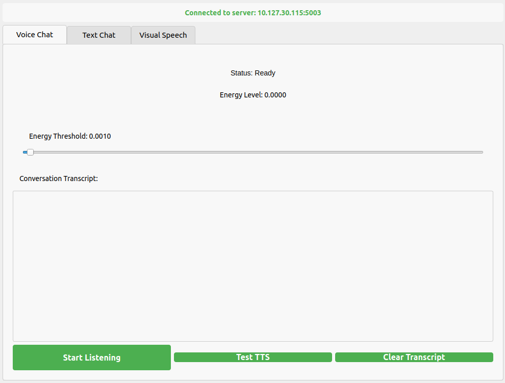

## LLMVoX: Autoregressive Streaming Text-to-Speech Model for Any LLM

<div>
<a href="https://mbzuai-oryx.github.io/LLMVoX/"></a>
<a href="https://arxiv.org/abs/2503.04724"></a>
<a href="https://github.com/mbzuai-oryx/LLMVoX/blob/main/LICENSE"></a>
</div>

<p align="center">
    
</p>

**[Sambal Shikhar](https://github.com/mbzuai-oryx/LLMVoX?tab=readme-ov-file)**, **[Mohammed Irfan K](https://scholar.google.com/citations?user=GJp0keYAAAAJ&hl=en)**, **[Sahal Shaji Mullappilly](https://scholar.google.com/citations?user=LJWxVpUAAAAJ&hl=en)**, **[Fahad Khan](https://sites.google.com/view/fahadkhans/home)**, **[Jean Lahoud](https://scholar.google.com/citations?user=LsivLPoAAAAJ&hl=en)**, **[Rao Muhammad Anwer](https://scholar.google.com/citations?hl=en&authuser=1&user=_KlvMVoAAAAJ)**, **[Salman Khan](https://salman-h-khan.github.io/)**, **[Hisham Cholakkal](https://scholar.google.com/citations?hl=en&user=bZ3YBRcAAAAJ)**

**Mohamed Bin Zayed University of Artificial Intelligence (MBZUAI), UAE**


<p align="center">
    
</p>


<video src="https://github.com/user-attachments/assets/6d305563-3c62-4f14-a8aa-acedf2143f76" width="200" controls></video>
## Overview

LLMVoX is a lightweight 30M-parameter, LLM-agnostic, autoregressive streaming Text-to-Speech (TTS) system designed to convert text outputs from Large Language Models into high-fidelity streaming speech with low latency. Our approach achieves significantly lower Word Error Rate compared to speech-enabled LLMs while operating at comparable latency and speech quality.

Key features:
- 🚀 **Lightweight & Fast**: Only 30M parameters, delivering speech with end-to-end latency as low as 300ms
- 🔌 **LLM-Agnostic**: Just plug with any existing LLM and Vision-Language Models without requiring fine-tuning or architectural modifications.
- 🌊 **Multi-Queue Streaming**: Enables continuous, low-latency speech generation and infinite-length dialogues
- 🌐 **Multilingual Support**: Easily adaptable to new languages with only dataset adaptation

### Requirements

```bash
# System requirements
# - CUDA 11.7 or higher
# - Flash Attention 2.0+ compatible GPU (Ampere architecture or newer)

# Clone the repository
git clone https://github.com/mbzuai-oryx/LLMVoX.git
cd LLMVoX

# Create and activate a conda environment
conda create -n llmvox python=3.9
conda activate llmvox

# Install PyTorch with CUDA 11.8 support
pip3 install torch torchvision torchaudio --index-url https://download.pytorch.org/whl/cu118

# Install Flash Attention
pip install flash-attn --no-build-isolation

# Install remaining dependencies
pip install -r requirements.txt


# Add path to wavtokenizer to avoid importing errors
export PYTHONPATH=./WavTokenizer/:$PYTHONPATH

# Download checkpoints (if not already in the repository)
mkdir -p CHECKPOINTS
# Download wavtokenizer_large_speech_320_24k.ckpt and ckpt_english_tiny.pt
# and place them in the CHECKPOINTS directory
```

## Quick Start

### Download Required Checkpoints

Download the necessary model checkpoints from Hugging Face:

🤗 **Hugging Face Repository**: [MBZUAI/LLMVoX](https://huggingface.co/MBZUAI/LLMVoX/tree/main)

### Configuration Basics

LLMVoX requires a few base paths to be set correctly in the inference configuration file at `configs/inference_config.py`:

* `wavtokenizer_model_path`: Path to the pretrained WavTokenizer model checkpoint
* `llmvox_checkpoint_path`: Path to the trained LLMVoX model checkpoint

### Running with Different Configurations

#### Voice Chat Configuration Guide

LLMVoX supports voice-based conversations through its streaming server. Here's how to configure and use the voice chat functionality:

##### Basic Usage

```bash
python streaming_server.py --chat_type voice --llm_checkpoint "meta-llama/Llama-3.1-8B-Instruct"
```

##### Configuration Parameters Explained

###### GPU Resource Allocation

LLMVoX uses a multi-queue approach with two TTS model replicas. You can specify which GPUs to use:

```bash
# Run TTS models on separate GPUs
python streaming_server.py --chat_type voice --llm_checkpoint "meta-llama/Llama-3.1-8B-Instruct" --tts_device_1 1 --tts_device_2 2

# Or run both on the same GPU (if memory allows)
python streaming_server.py --chat_type voice --llm_checkpoint "meta-llama/Llama-3.1-8B-Instruct" --tts_device_1 0 --tts_device_2 0

# Specify GPU for LLM separately
python streaming_server.py --chat_type voice --llm_checkpoint "meta-llama/Llama-3.1-8B-Instruct" --llm_device "cuda:0" --tts_device_1 1 --tts_device_2 2
```

###### Streaming Chunk Size Parameters

Control the balance between latency and quality:

```bash
# Lower latency setup (faster initial response but potentially lower quality)
python streaming_server.py --chat_type voice --llm_checkpoint "meta-llama/Llama-3.1-8B-Instruct" --initial_dump_size_1 5 --initial_dump_size_2 40 --max_dump_size 320

# Higher quality setup (slightly higher latency but better speech)
python streaming_server.py --chat_type voice --llm_checkpoint "meta-llama/Llama-3.1-8B-Instruct" --initial_dump_size_1 20 --initial_dump_size_2 320 --max_dump_size 2560

# Default balanced setup
python streaming_server.py --chat_type voice --llm_checkpoint "meta-llama/Llama-3.1-8B-Instruct" --initial_dump_size_1 10 --initial_dump_size_2 160 --max_dump_size 1280
```

- **`initial_dump_size_1`**: Number of speech tokens for the first chunk (smaller = faster first response)
- **`initial_dump_size_2`**: Initial chunk size for the second TTS model (can be larger as it runs while first chunk plays)
- **`max_dump_size`**: Maximum chunk size that the system will scale up to (larger = better quality)

###### LLM-Specific Parameters

Different LLMs use different end-of-sequence tokens:

```bash
# For LLaMA models
python streaming_server.py --chat_type voice --llm_checkpoint "meta-llama/Llama-3.1-8B-Instruct" --eos_token "<|eot_id|>" --llm_max_tokens 1000

# For Mistral models
python streaming_server.py --chat_type voice --llm_checkpoint "mistralai/Mistral-7B-Instruct-v0.2" --eos_token "<|im_end|>" --llm_temperature 0.7

# For other models (check your model's documentation)
python streaming_server.py --chat_type voice --llm_checkpoint "your-model-name" --eos_token "<|end|>"
```

###### ASR Configuration (for Speech Input)

LLMVoX uses Whisper for converting speech to text:

```bash
# Use a larger Whisper model for better transcription
python streaming_server.py --chat_type voice --llm_checkpoint "meta-llama/Llama-3.1-8B-Instruct" --asr_model "medium" --asr_device "cuda:3"

# Use a smaller model for faster processing
python streaming_server.py --chat_type voice --llm_checkpoint "meta-llama/Llama-3.1-8B-Instruct" --asr_model "tiny" --asr_device "cuda:0"
```

###### System Prompt Customization

Control the LLM's response style:

```bash
# For concise responses
python streaming_server.py --chat_type voice --llm_checkpoint "meta-llama/Llama-3.1-8B-Instruct" --system_prompt "You are a friendly voicebot that answers questions in a concise way and do not use abbreviation. Keep responses brief."

# For more detailed explanations
python streaming_server.py --chat_type voice --llm_checkpoint "meta-llama/Llama-3.1-8B-Instruct" --system_prompt "You are a helpful AI assistant that provides detailed, thorough explanations. Avoid abbreviations when speaking."
```

###### Complete Example

Here's a complete example with all key parameters configured:

```bash
python streaming_server.py \
  --chat_type voice \
  --llm_checkpoint "meta-llama/Llama-3.1-8B-Instruct" \
  --llm_device "cuda:0" \
  --tts_device_1 1 \
  --tts_device_2 2 \
  --asr_model "small" \
  --asr_device "cuda:3" \
  --initial_dump_size_1 10 \
  --initial_dump_size_2 160 \
  --max_dump_size 1280 \
  --max_audio_length 8000 \
  --eos_token "<|eot_id|>" \
  --system_prompt "You are a friendly voicebot that answers questions concisely without abbreviations."
```

###### How it Works

When you run voice chat:

1. The ASR model transcribes your speech input
2. The LLM generates a response text stream
3. Two LLMVoX instances alternate processing text chunks at sentence boundaries 
4. Initial chunks are smaller for faster response, while later chunks are larger for better quality
5. Audio is played in real-time while the rest of the response is still being generated

This multi-queue architecture enables both low latency (as fast as 300ms) and high-quality speech output.

#### Text Chat (Text-to-Speech)

```bash
# Basic text chat with LLaMA 3.1 8B
python streaming_server.py --chat_type text --llm_checkpoint "meta-llama/Llama-3.1-8B-Instruct" --llm_device "cuda:0"

# Customize LLM generation parameters
python streaming_server.py --chat_type text --llm_checkpoint "meta-llama/Llama-3.1-8B-Instruct" --llm_temperature 0.5 --llm_top_p 0.9 --llm_top_k 30
```

#### Visual Speech (Speech + Image → Speech)

```bash
# Using Qwen 2.5 VL as the vision-language model
python streaming_server.py --chat_type visual_speech --llm_checkpoint "Qwen/Qwen2.5-VL-7B-Instruct" --llm_device "cuda:0"  --asr_model "small" --eos_token "<|im_end|>"
```

#### Multimodal Chat with no ASR for models like Phi-4-multimodal-instruct (Speech + Image → Speech) 

```bash
# Using Phi-4-multimodal-instruct which has multimodal input with speech , images and text 
python streaming_server.py --chat_type multimodal --llm_checkpoint "microsoft/Phi-4-multimodal-instruct" --llm_device "cuda:0" --sytem_prompt  ""Answer the question in short responses." --eos_token "<|end|>"

# Using LLaVA
python streaming_server.py --chat_type multimodal --llm_checkpoint "llava-hf/llava-1.5-7b-hf" --llm_device "cuda:0"
```

# Client side API reference 

Once the streaming server starts , the following is the client side API reference.
### Endpoints & Parameters

| Endpoint | Purpose | Required Parameters |
|----------|---------|---------------------|
| `/tts` | Text-to-speech | `text`: String to convert |
| `/voicechat` | Voice conversations | `audio_base64`: Encoded speech<br>`source_language`: Input language for Whisper ASR<br>`target_language`: Output language for Whisper ASR |
| `/multimodalchat` | Voice + multiple images | `audio_base64`: Encoded speech<br>`image_list`: Array of base64 images |
| `/vlmschat` | Voice + single image | `audio_base64`: Encoded speech<br>`image_base64`: Single image<br>`source_language`: Input language for Whisper ASR<br>`target_language`: Output language for Whisper ASR |


```python
# Text-to-Speech
api_call("tts", {"text": "Hello world"})

# Voice Chat
api_call("voicechat", {
    "audio_base64": audio_data,
    "source_language": "English",
    "target_language": "English"
})

# Multimodal Chat (voice + images) for models like Phi-4-multimodal-instruct
api_call("multimodalchat", {
    "audio_base64": audio_data,
    "image_list": [image_base64]
})

# Visual Language Model (voice + image)
api_call("vlmschat", {
    "audio_base64": audio_data,
    "image_base64": image_base64,
    "source_language": "English",
    "target_language": "English"
})
```

## Common Streaming Pattern

```python
import threading
import queue
import requests
import torch
import torchaudio
import numpy as np
from pyaudio import PyAudio, paFloat32
import time


def tts(text, audio_outpath='output_audio.wav'):
    server_ip = "10.127.30.115"
    endpoint = f'http://{server_ip}:5003/tts'

    # Audio playback parameters
    sample_rate = 24000
    channels = 1
    chunk_size = 10000
    frames_per_buffer = 10000  # Must match the server's chunk size if possible

    audio_queue = queue.Queue()  # Buffer for audio playback
    audio_chunks = []  # Buffer to store audio for saving
    start=time.time()
    def stream_audio():
        """Streams audio from the server and enqueues it for playback and saving."""
        try:
            with requests.post(endpoint, json={"text": text}, stream=True) as stream:
                stream.raise_for_status()  # Raise an error for bad status codes
                for chunk in stream.iter_content(chunk_size=None):
                    if chunk:
                        try:
                            # Enqueue the chunk for playback
                            print(f"Got chunk at {time.time()-start}")
                            audio_queue.put(chunk, timeout=1)
                            # Store the chunk for saving
                            audio_chunks.append(chunk)
                        except queue.Full:
                            print("Audio queue is full. Dropping chunk.")
        except requests.exceptions.RequestException as e:
            print(f"RequestException: {e}")
        finally:
            # Signal the end of streaming
            audio_queue.put(None)

    def play_audio():
        """Plays audio chunks from the queue using PyAudio."""
        p = PyAudio()
        try:
            player = p.open(format=paFloat32,
                            channels=channels,
                            rate=sample_rate,
                            output=True,)

            while True:
                chunk = audio_queue.get()
                if chunk is None:
                    print("End of streaming.")
                    break  # End of streaming
                if not chunk:
                    print("Received an empty chunk. Skipping.")
                    continue  # Skip empty chunks

                try:
                    print("Playing chunk")
                    player.write(chunk)
                except Exception as e:
                    print(f"Error during playback: {e}")
                    break
        finally:
            player.stop_stream()
            player.close()
            p.terminate()

    # Start streaming and playback in separate threads
    stream_thread = threading.Thread(target=stream_audio, daemon=True)
    play_thread = threading.Thread(target=play_audio, daemon=True)

    stream_thread.start()
    play_thread.start()

    # Wait for both threads to finish
    stream_thread.join()
    play_thread.join()

    # After streaming is complete, process and save the audio
    if audio_chunks:
        print("Saving audio to file...")

        # Concatenate all audio   kjb jb into a single bytes object
        audio_bytes = b''.join(audio_chunks)

        # Convert bytes to a NumPy array of float32
        audio_np = np.frombuffer(audio_bytes, dtype=np.float32)

        # Optional: Normalize if necessary
        # Uncomment the following lines if you need to normalize the audio
        # max_val = np.max(np.abs(audio_np))
        # if max_val > 1.0:
        #     audio_np = audio_np / max_val

        # Reshape the array to (channels, samples)
        if channels > 1:
            audio_np = audio_np.reshape(-1, channels).T  # Transpose to (channels, samples)
        else:
            audio_np = audio_np.reshape(1, -1)  # (1, samples)

        # Convert float32 to int16 for 'PCM_S' encoding
        # Ensure the float32 data is in the range [-1.0, 1.0]
        audio_np = np.clip(audio_np, -1.0, 1.0)
        audio_int16 = (audio_np * 32767).astype(np.int16)

        # Convert NumPy array to PyTorch tensor
        audio_tensor = torch.from_numpy(audio_int16)

        # Save the audio using torchaudio with specified settings
        try:
            torchaudio.save(
                audio_outpath,
                audio_tensor,
                sample_rate=sample_rate,
                encoding='PCM_S',
                bits_per_sample=16,
                format='wav'
            )
            print(f"Audio successfully saved to {audio_outpath}")
        except Exception as e:
            print(f"Error saving audio: {e}")
    else:
        print("No audio chunks received. Nothing to save.")

if __name__ == '__main__':
    text="hello how are you?"
    tts(text,audio_outpath="output.wav")
```
### Custom models
You can easily create text-streamer for your custom model and integrate it with LLMVoX in `streaming_server.py` , refer to  `inference` folder to see the streamer template for LLMs ,VLMs and Multimodal LLMs.


# Local Demo UI
<p align="center">
    
</p>

This local demo UI is built using PyQt5.
#### Launch demo
```
#Run a streaming server
python streaming_server.py --chat_type voice --llm_checkpoint "meta-llama/Llama-3.1-8B-Instruct" --eos_token "<|eot_id|>" --llm_max_tokens 1000 --api_port PORT
#Run local demo UI
python run_ui.py --ip STREAMING_SERVER_IP --port PORT 

```

#### Interaction Modes
- Voice Chat
- Text Chat
- Visual Speech

# Training Guide

### Dataset Preparation

- **Dataset**: [VoiceAssistant-400K](https://huggingface.co/datasets/gpt-omni/VoiceAssistant-400K)
- **Format**: JSON file with entries mapping text to audio files:
```json
[
  {
    "speech_folder": "/path/to/audio/files",
    "speech_file": "audio1.wav",
    "answer_text": "Text transcript",
    "id": "unique_id_1"
  }
]
```
### Key Configuration Parameters

The training configuration is in `configs/train_config.py`:

- **Model Architecture**: 
  - `n_layer`: Number of transformer layers (default: 4)
  - `n_head`: Number of attention heads (default: 8)
  - `n_embd`: Embedding dimension (default: 768)
  - `block_size`: Context length (default: 8192)

- **Training Settings**:
  - `gradient_accumulation_steps`: Accumulate gradients before updating (default: 4)
  - `batch_size`: Batch size per GPU (default: 2)
  - `learning_rate`: Peak learning rate (default: 3e-4)
  - `max_iters`: Maximum iterations (default: 2600000)

- **Paths**:
  - `data_path`: Path to dataset JSON
  - `speech_data_folder`: Path to audio files
  - `out_dir`: Output directory for checkpoints
  - `encoder_model_path`: Path to ByT5 model for multilingual grapheme-to-phoneme conversion from [CharsiuG2P](https://github.com/lingjzhu/CharsiuG2P/tree/main) that provides phoneme embeddings for words

```bash
python train.py \
  --n_layer=4 \
  --n_head=8 \
  --n_embd=768 \
  --block_size=8192 \
  --dropout=0.0 \
  --bias=False \
  --data_path="/path/to/dataset.json" \
  --speech_data_folder="/path/to/audio_files" \
  --encoder_model_path="charsiu/g2p_multilingual_byT5_tiny_16_layers_100" \
  --tokenizer_path="google/byt5-small" \
  --wav_config_path="WavTokenizer/configs/wavtokenizer_smalldata_frame75_3s_nq1_code4096_dim512_kmeans200_attn.yaml" \
  --wav_model_path="/path/to/wavtokenizer_large_speech_320_24k.ckpt" \
  --out_dir="my_llmvox_model" \
  --batch_size=2 \
  --gradient_accumulation_steps=4 \
  --learning_rate=3e-4 \
  --weight_decay=1e-1 \
  --warmup_iters=50000 \
  --lr_decay_iters=2600000 \
  --min_lr=3e-6 \
  --eval_interval=1000 \
  --compile=True \
  --wandb_log=True \
  --wandb_project="speech_stream" \
  --wandb_run_name="llmvox_training_run"
```

This comprehensive command shows all configurable parameters for training a LLMVoX model. Adjust values based on your hardware capabilities and specific requirements.

### Launch Training
```bash
#Single GPU
python train.py --batch_size=8 --learning_rate=5e-5 --n_layer=6
#Distributed Training
torchrun --standalone --nproc_per_node=4 train.py --batch_size=16
```

## Citation

If you find our work useful, please consider citing:

```bibtex
@article{shikhar2025llmvox,
  title={LLMVoX: Autoregressive Streaming Text-to-Speech Model for Any LLM},
  author={Shikhar, Sambal and Kurpath, Mohammed Irfan and Mullappilly, Sahal Shaji and Lahoud, Jean and Khan, Fahad and Anwer, Rao Muhammad and Khan, Salman and Cholakkal, Hisham},
  journal={arXiv preprint arXiv:2503.04724},
  year={2025}
}
```

## Acknowledgments

We thank the reviewers and colleagues who provided valuable feedback on this work. We also acknowledge the open-source contributions that made this project possible:

- [Andrej Karpathy's NanoGPT](https://github.com/karpathy/nanoGPT) - Training code for LLMVoX is based on this repository
- [WavTokenizer](https://github.com/jishengpeng/WavTokenizer?tab=readme-ov-file) - For audio tokenization
- [Whisper](https://github.com/openai/whisper) - Used for ASR in our pipeline
- [Neural G2P](https://github.com/lingjzhu/CharsiuG2P) - For the multilingual phoneme embeddings

## License

This project is licensed under the MIT License - see the [LICENSE](LICENSE) file for details.
